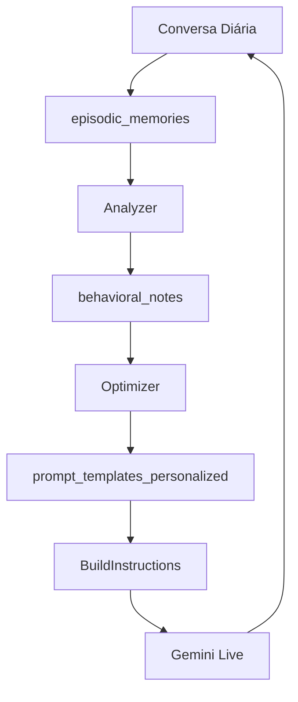

# 📊 EVA-Markov: Arquitetura Técnica

## Visão Geral

EVA-Markov implementa o padrão **Meta-Agent** inspirado no framework Confucius (Meta/Harvard), adaptado para o domínio de cuidados geriátricos.

## Componentes Principais

### 1. Analyzer (Analisador Comportamental)

**Responsabilidade:** Processar logs de conversas e extrair insights comportamentais.

**Fluxo:**
```
Episodic Memories (DB) 
    → Agrupar por Idoso 
    → Construir Transcrição 
    → LLM Analysis (Gemini) 
    → Extrair Insights 
    → Salvar em behavioral_notes
```

**Insights Gerados:**
- `communication_style`: Preferências de tom e linguagem
- `preferences`: Tópicos de interesse, horários preferidos
- `triggers`: Gatilhos emocionais (positivos/negativos)
- `failures`: Padrões que não funcionaram

### 2. Optimizer (Otimizador de Prompts)

**Responsabilidade:** Gerar prompts personalizados baseado em insights.

**Fluxo:**
```
Insights (behavioral_notes) 
    → Buscar Prompt Atual 
    → Meta-Prompt Generation 
    → LLM Optimization (Gemini) 
    → Versionar e Salvar 
    → Ativar Novo Prompt
```

**Estratégia de Versionamento:**
- Cada idoso pode ter múltiplas versões de prompt
- Apenas 1 versão ativa por vez
- Histórico completo mantido para rollback

### 3. Scheduler (Orquestrador)

**Responsabilidade:** Coordenar execução noturna do ciclo Build-Test-Improve.

**Ciclo Diário:**
```
23:00 → Analyzer.AnalyzeDailyConversations()
23:30 → Optimizer.OptimizePrompts()
00:00 → Cleanup e Logging
```

## Modelo de Dados

### Tabelas Principais

#### `behavioral_notes`
Armazena observações comportamentais extraídas das conversas.

```sql
{
  idoso_id: 123,
  category: "communication_style",
  observation: "Responde melhor a tom carinhoso",
  confidence: 0.85,
  evidence: ["trecho1", "trecho2"]
}
```

#### `prompt_templates_personalized`
Armazena prompts otimizados por idoso.

```sql
{
  idoso_id: 123,
  content: "Você é a EVA cuidando da Dona Maria...",
  version: 3,
  active: true
}
```

#### `interaction_scores`
Métricas de qualidade das interações.

```sql
{
  idoso_id: 123,
  overall_score: 8.5,
  adherence_score: 9.0,
  satisfaction_score: 8.0
}
```

## Integração com EVA-Mind

### Modificação Necessária em `BuildInstructions`

```go
// EVA-Mind/internal/signaling/websocket.go

func BuildInstructions(idosoID int64, db *sql.DB) string {
    // ... código existente ...
    
    // ✅ NOVO: Buscar prompt personalizado
    var customPrompt string
    err := db.QueryRow(`
        SELECT content 
        FROM prompt_templates_personalized 
        WHERE idoso_id = $1 AND active = true
    `, idosoID).Scan(&customPrompt)
    
    if err == nil {
        // Usar prompt personalizado
        instructions = customPrompt
    } else {
        // Fallback para prompt base
        instructions = template
    }
    
    // ... resto do código ...
}
```

## Fluxo de Dados Completo



## Métricas e Monitoramento

### KPIs Principais

1. **Taxa de Otimização:** % de idosos com prompts personalizados
2. **Score Médio:** Média de `overall_score` por idoso
3. **Melhoria de Adesão:** Δ `adherence_score` antes/depois

### Queries de Monitoramento

```sql
-- Dashboard de Status
SELECT * FROM v_idoso_optimization_status;

-- Top 10 Idosos com Melhor Score
SELECT idoso_id, AVG(overall_score) as avg_score
FROM interaction_scores
WHERE created_at >= NOW() - INTERVAL '7 days'
GROUP BY idoso_id
ORDER BY avg_score DESC
LIMIT 10;

-- Insights Mais Comuns
SELECT category, COUNT(*) as total
FROM behavioral_notes
WHERE active = true
GROUP BY category
ORDER BY total DESC;
```

## Considerações de Performance

### Otimizações Implementadas

1. **Processamento Paralelo:** Análise de múltiplos idosos em goroutines
2. **Batch Processing:** Agrupamento de queries ao banco
3. **Caching:** Prompts base carregados uma vez
4. **Timeout:** Limite de 1h para execução completa

### Limites

- **Max Idosos/Execução:** 1000
- **Max Conversas/Idoso:** 100 (últimas 24h)
- **Timeout LLM:** 30s por chamada

## Segurança

### Dados Sensíveis

- API Keys armazenadas em Secret Manager (GCP)
- Conexão DB via SSL
- Logs sanitizados (sem PII)

### Auditoria

Toda otimização é registrada em `optimization_history`:
```sql
{
  idoso_id: 123,
  optimization_type: "prompt_update",
  before_state: {...},
  after_state: {...},
  success: true
}
```

## Roadmap Técnico

### Fase 1 (Atual)
- ✅ Analyzer básico
- ✅ Optimizer de prompts
- ✅ Scheduler noturno

### Fase 2 (Próxima)
- [ ] A/B Testing de prompts
- [ ] Feedback loop automático
- [ ] Dashboard web

### Fase 3 (Futuro)
- [ ] Multi-agentes especializados
- [ ] Tools com memória própria
- [ ] Fine-tuning de modelos
